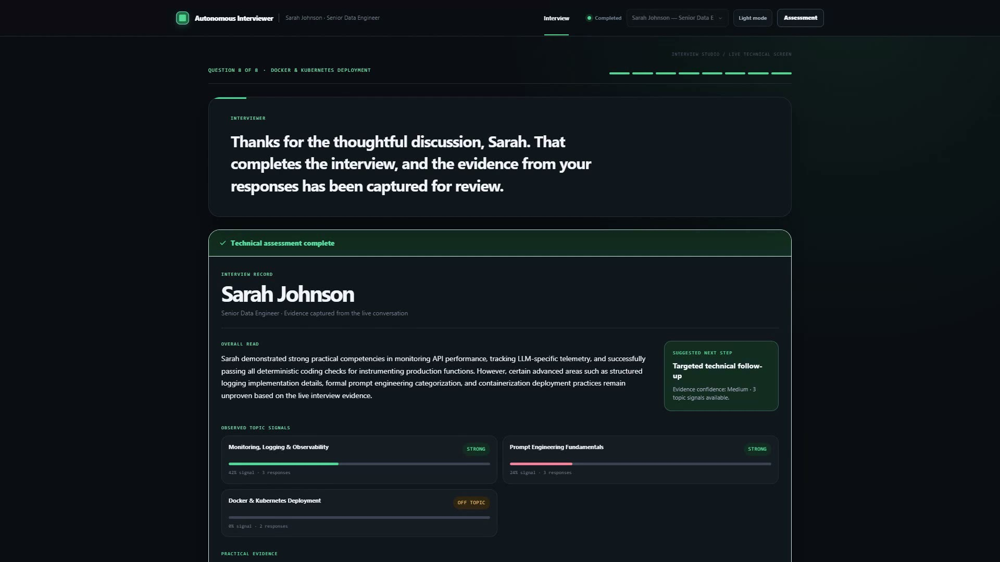

# Autonomous Interviewer


Technical hiring should reveal how someone thinks — not just how well they answer a list of questions.

Autonomous Interviewer is a multi-turn technical interviewer that follows the candidate’s reasoning, decides when a claim should be tested in code, and turns the conversation into hiring-ready evidence.

**Live app:** [https://ai-technical-interviewer-orpin.vercel.app/](https://ai-technical-interviewer-orpin.vercel.app/)

## Product demo

[](https://github.com/priyanshuchawda/ai-technical-interviewer/blob/main/public/demo/autonomous-interviewer-demo.mp4)

[Watch the 1:56 demo with voice-over →](https://github.com/priyanshuchawda/ai-technical-interviewer/blob/main/public/demo/autonomous-interviewer-demo.mp4) · [Captions](./public/demo/autonomous-interviewer-demo.srt)

Sarah Johnson interviews for Senior Data Engineer. The interviewer goes deeper on observability, introduces a focused coding check only when a claim should be tested, then produces an evidence-backed assessment.

## What it does

- **Conversational technical screen** grounded in the 31-day AI Cohort curriculum
- **Adaptive follow-ups** from the candidate’s last answer, not a fixed script
- **Opportunistic coding** when a practical claim should be tested in production-style code
- **Deterministic checks** so implementations become interview evidence, not a throwaway editor
- **Hiring-ready assessment** with demonstrated topics, gaps, and suggested follow-up
- **Speech + text input** for a realistic interview flow
- **`POST /api/interview`** matching the [technical spec](./technical-spec.md)

## Architecture

| Layer | Stack |
| --- | --- |
| App | Next.js App Router, React 19, TypeScript (strict) |
| UI | Design tokens + vanilla CSS |
| Dialogue | Gemini |
| Memory | Breeth Graph Memory |
| Evaluation | Deterministic scoring + evidence aggregation |
| Tests | Vitest, Playwright laptop/mobile e2e, staging smoke |

## Getting started

```bash
git clone https://github.com/priyanshuchawda/ai-technical-interviewer.git
cd ai-technical-interviewer
npm install
cp .env.example .env.local
npm run dev
```

Open [http://localhost:3000](http://localhost:3000).

Fill `.env.local` (never commit real keys):

```env
BREETH_API_KEY=""
BREETH_API_URL="https://api.thebreeth.com"
GEMINI_API_KEY=""
GEMINI_MODEL="gemini-3.5-flash-lite"
```

Production vars are listed in `.env.example` (`INTERVIEW_API_KEY`, session store, rate limits). See [docs/operations.md](docs/operations.md) for deploy, auth, durable sessions, metrics, and runbook notes.

## API

```http
POST /api/interview
```

Start with `sessionId` + `candidate`, then send `message` on each turn. When the interview is complete the response includes `done: true` and structured `feedback`.

Details: [technical-spec.md](./technical-spec.md)

## Verification

```bash
npm test
npm run test:e2e
STAGING_URL=https://ai-technical-interviewer-orpin.vercel.app npm run test:staging
npm run lint
npm run typecheck
npm run build
```

## Docs

- [Technical spec](./technical-spec.md)
- [Operations](./docs/operations.md)
- [Contributing](./CONTRIBUTING.md)
- [Prompt log](./PROMPTS.md)

## License

MIT
